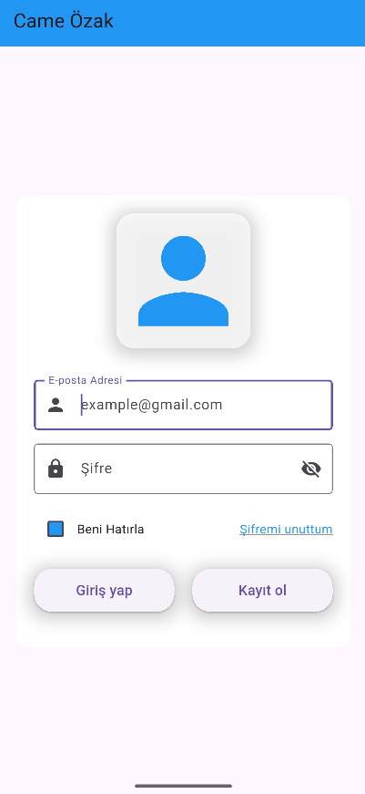
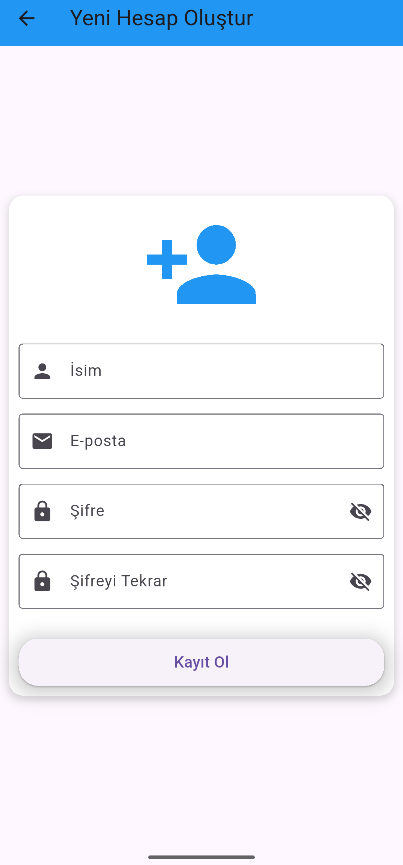
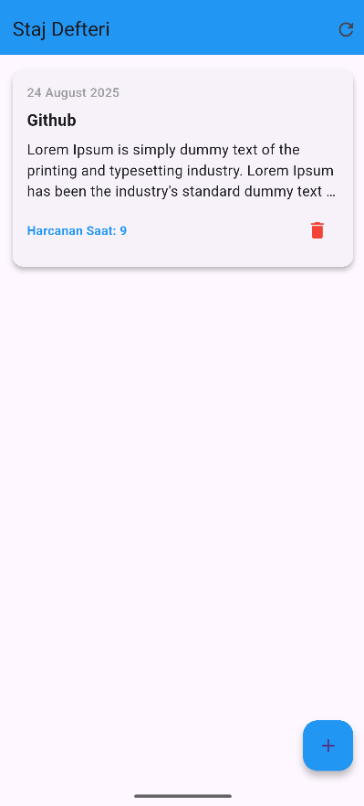
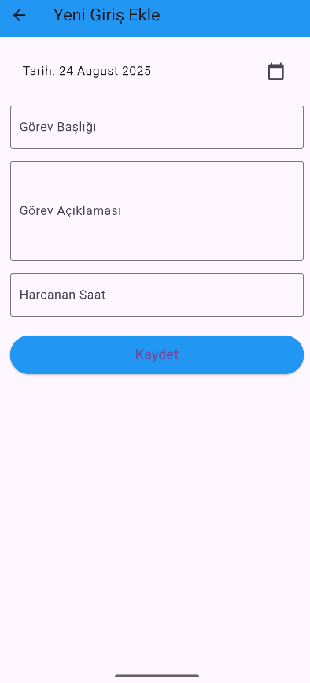
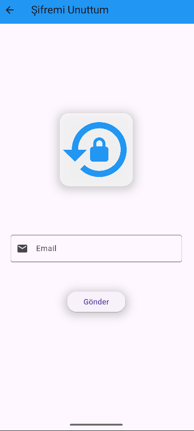
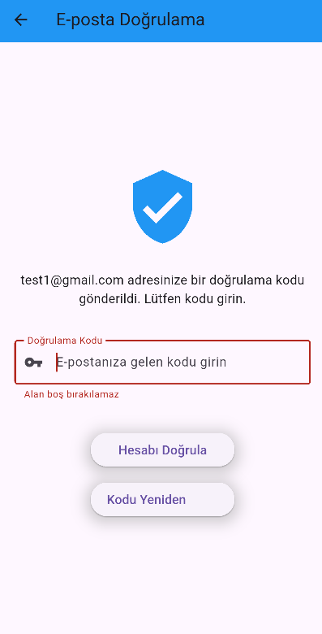
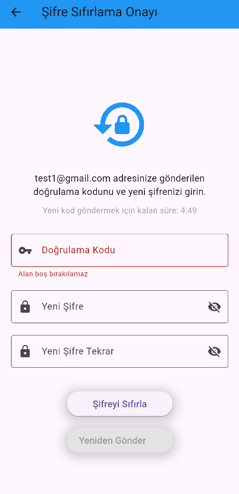

# Staj Not Uygulaması Frontend

Bu proje, Came Özak'taki staj sürecimde geliştirdiğim staj not uygulamasının mobil (Android ve iOS) kullanıcı arayüzüdür. Stajyerlerin günlük notlarını kolayca eklemesini, düzenlemesini ve görüntülemesini sağlar.

Projenin backend kısmı https://github.com/BerkayYuce/CameLaravel-InternNote deposunda yer almaktadır.

---

### 🌟 Özellikler

- **Kullanıcı Doğrulama:** Giriş yapma, kayıt olma, şifre sıfırlama.
- **Güvenli API İletişimi:** Laravel Sanctum ile token tabanlı kimlik doğrulama.
- **Staj Notları Yönetimi:** Staj notlarını listeleme, ekleme, güncelleme ve silme.
- **Offline Özellikler:** Gerekli verileri yerel olarak depolama.

### ⚙️ Kullanılan Teknolojiler

- **Flutter 3.x**: Cross-platform mobil uygulama geliştirme framework'ü.
- **Dart**: Geliştirme dili.
- **BLoC (Business Logic Component)**: Uygulama durum yönetimi için kullanılan mimari.
- **Dio**: API istekleri için güçlü bir HTTP istemcisi.
- **Shared Preferences**: Basit verileri yerel olarak depolama.
- **GetIt**: Servis bulucu (service locator).

### 📱 Ekranlar

| Giriş Ekranı | Kayıt Ekranı |
|:---:|:---:|
|  |  |

| Not Listesi | Yeni Not Ekleme | Şifremi Unuttum |
|:---:|:---:|:---:|
|  |  |  |

| E-mail Doğrulama | Şifre Doğrulama  |
|:---:|:---:|
|  |  |
